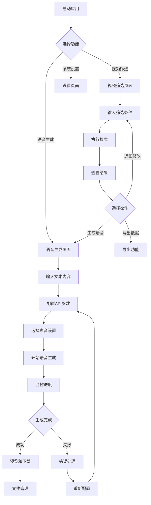

## 1. 产品概述

YouTube视频筛选和语音生成桌面工具是一款专为内容创作者、营销人员和研究人员设计的跨平台应用程序。该工具能够帮助用户快速筛选符合条件的YouTube视频，并将文本内容转换为语音文件。

产品主要解决以下问题：
- 帮助用户从海量YouTube视频中快速找到符合特定条件的优质内容
- 提供便捷的文本转语音功能，支持多种语言和声音选择
- 简化内容创作流程，提高工作效率

目标用户群体：内容创作者、数字营销人员、学术研究人员、视频制作团队

## 2. 核心功能

### 2.1 用户角色

| 角色 | 注册方式 | 核心权限 |
|------|----------|----------|
| 普通用户 | 邮箱注册 | 基础视频筛选、语音生成（有限制次数） |
| 高级用户 | 订阅升级 | 无限制视频筛选、批量语音生成、高级筛选选项 |

### 2.2 功能模块

本工具包含以下主要功能模块：

1. **视频筛选模块**：关键词搜索、多维度筛选、结果展示
2. **语音生成模块**：文本输入、API配置、语音合成、文件下载
3. **数据管理模块**：本地数据存储、历史记录、批量操作
4. **系统设置模块**：API密钥管理、用户偏好设置、系统配置

### 2.3 页面详情

| 页面名称 | 模块名称 | 功能描述 |
|----------|----------|----------|
| 主界面 | 导航栏 | 显示应用logo、页面切换按钮、用户状态 |
| 主界面 | 视频筛选区 | 关键词输入框、筛选条件设置、搜索按钮 |
| 主界面 | 筛选条件面板 | 发布时间选择器、播放量范围滑块、点赞量范围设置 |
| 主界面 | 搜索结果列表 | 视频缩略图、标题、关键数据展示、选择复选框 |
| 主界面 | 批量操作栏 | 全选/取消全选、导出选中、生成语音按钮 |
| 语音生成 | 文本输入区 | 多行文本编辑器、字数统计、文本导入 |
| 语音生成 | API配置面板 | 服务商选择下拉框、API密钥输入、语言选择 |
| 语音生成 | 声音设置 | 声音类型选择、语速调节、音调调节 |
| 语音生成 | 生成控制 | 开始生成按钮、进度条、暂停/继续按钮 |
| 语音生成 | 文件管理 | 生成文件列表、播放预览、下载按钮、删除按钮 |
| 设置页面 | API管理 | API密钥添加/编辑/删除、连接测试 |
| 设置页面 | 用户偏好 | 默认保存路径、界面语言、主题选择 |
| 设置页面 | 系统信息 | 版本信息、更新检查、日志查看 |

## 3. 核心流程

### 3.1 视频筛选流程
用户打开应用 → 输入关键词 → 设置筛选条件 → 执行搜索 → 浏览结果 → 选择目标视频 → 进行后续操作

### 3.2 语音生成流程
用户输入文本 → 配置API参数 → 选择声音设置 → 开始生成 → 监控进度 → 预览结果 → 下载文件

## 4. 用户界面设计

### 4.1 设计风格
- **主色调**：深蓝色（#1E3A8A）配白色背景，强调专业性
- **辅助色**：浅灰色（#F3F4F6）用于背景和分隔，绿色（#10B981）用于成功状态
- **按钮样式**：圆角矩形，悬停效果，主要操作使用主色调
- **字体**：系统默认字体，标题16px，正文14px，小字12px
- **布局风格**：左侧导航栏 + 右侧主内容区的经典桌面应用布局
- **图标风格**：使用简洁的线性图标，保持视觉一致性

### 4.2 页面设计概述

| 页面名称 | 模块名称 | UI元素 |
|----------|----------|--------|
| 主界面 | 导航栏 | 左侧logo，中间页面标签，右侧用户头像和下拉菜单 |
| 主界面 | 搜索区域 | 顶部关键词输入框，下方展开式高级筛选面板 |
| 主界面 | 结果列表 | 卡片式布局，每行显示视频缩略图和信息，支持多选 |
| 语音生成 | 输入区域 | 左侧大文本框，右侧实时预览和统计信息 |
| 语音生成 | 控制面板 | 底部固定工具栏，包含生成按钮和进度显示 |
| 设置页面 | 分类列表 | 左侧设置分类菜单，右侧对应设置面板 |

### 4.3 响应式设计
- 桌面端优先设计，最小支持1280x720分辨率
- 支持窗口大小调整，主要内容区域自适应
- 考虑高分屏显示优化，支持UI缩放

## 5. 技术要求

### 5.1 开发技术栈
- **前端框架**：Electron + React + TypeScript
- **UI库**：Ant Design或Material-UI
- **状态管理**：Redux Toolkit
- **打包工具**：Vite
- **跨平台**：Electron Builder

### 5.2 第三方API集成
- YouTube Data API v3（视频搜索和筛选）
- Google Cloud Text-to-Speech API
- Azure Cognitive Services Speech Service
- OpenAI TTS API

### 5.3 数据存储
- **本地数据库**：SQLite（用户数据、历史记录）
- **配置文件**：JSON格式（用户设置、API配置）
- **缓存机制**：本地文件缓存（搜索结果、临时文件）

## 6. 性能要求

### 6.1 响应性能
- 应用启动时间：≤ 3秒
- 搜索响应时间：≤ 5秒（首次搜索）
- 语音生成速度：≥ 实时速度的1.5倍
- 界面切换延迟：≤ 100ms

### 6.2 资源占用
- 内存占用：≤ 500MB（正常使用）
- CPU占用：≤ 30%（语音生成时）
- 磁盘空间：≤ 100MB（应用本身）

### 6.3 并发处理
- 支持同时处理多个语音生成任务
- 批量视频筛选时支持进度显示和中断操作
- 后台任务不影响前台界面响应

## 7. 数据安全和隐私

### 7.1 数据保护
- 所有API密钥本地加密存储（AES-256）
- 用户敏感信息不上传至任何服务器
- 支持应用锁定功能（密码或生物识别）

### 7.2 隐私合规
- 遵守YouTube API服务条款
- 明确告知用户数据使用范围
- 提供数据导出和删除功能
- 不收集用户个人身份信息

### 7.3 安全更新
- 支持自动更新检查
- 提供安全漏洞报告渠道
- 定期更新依赖库版本

## 8. 项目里程碑

### 第一阶段（4周）- MVP版本
- 第1周：项目架构搭建，基础UI框架
- 第2周：YouTube API集成，基础筛选功能
- 第3周：语音合成功能开发，文件下载
- 第4周：测试优化，基础版本发布

### 第二阶段（3周）- 功能完善
- 第5周：高级筛选选项，批量处理优化
- 第6周：多API支持，用户偏好设置
- 第7周：性能优化，稳定性改进

### 第三阶段（2周）- 发布准备
- 第8周：跨平台打包测试
- 第9周：文档完善，正式发布

## 9. 风险评估与应对

### 9.1 技术风险
- API限制和配额：实现API密钥轮换机制
- 跨平台兼容性：早期进行多平台测试
- 性能瓶颈：使用性能监控工具及时优化

### 9.2 合规风险
- YouTube API政策变化：定期关注政策更新
- 隐私法规遵循：咨询法律专业人士

### 9.3 市场风险
- 竞争对手产品：持续关注市场动态
- 用户需求变化：建立用户反馈机制