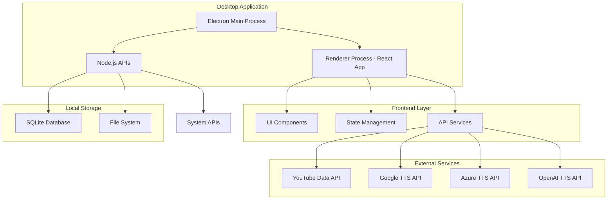
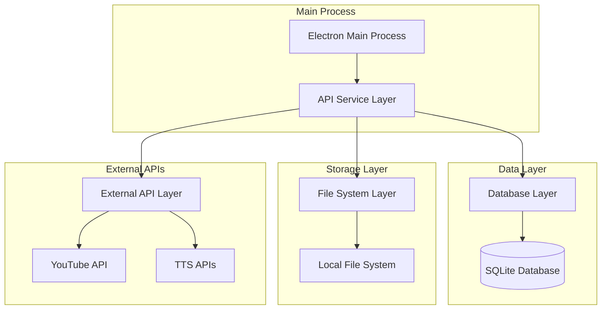
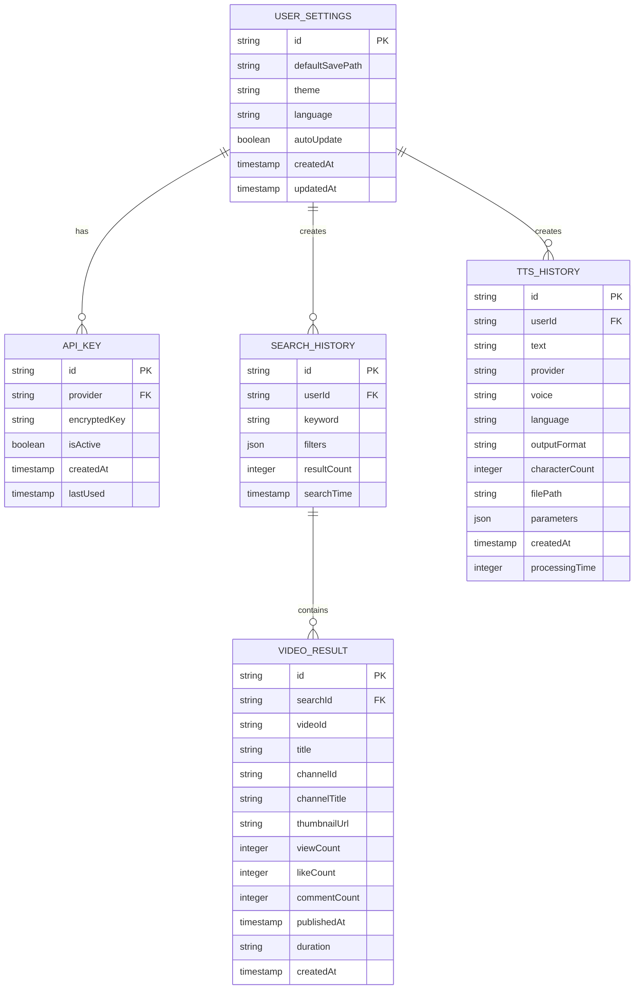

## 1. 架构设计



## 2. 技术描述

### 2.1 核心技术栈
- **桌面应用框架**：Electron@27 + Node.js@18
- **前端框架**：React@18 + TypeScript@5
- **UI组件库**：Ant Design@5 + Styled Components
- **状态管理**：Redux Toolkit@2 + RTK Query
- **构建工具**：Vite@5 + electron-builder@24
- **数据库**：SQLite3@5 + better-sqlite3@9
- **音频处理**：Web Audio API + FFmpeg（可选）

### 2.2 开发依赖
- **代码质量**：ESLint@8 + Prettier@3 + Husky@8
- **测试框架**：Jest@29 + React Testing Library@14
- **类型定义**：@types/node, @types/react, @types/electron
- **开发工具**：electron-devtools-installer, concurrently

## 3. 路由定义

### 3.1 应用路由结构
| 路由路径 | 组件 | 描述 |
|----------|------|------|
| / | Dashboard | 主控制台，显示应用概览 |
| /video-filter | VideoFilterPage | 视频筛选功能主页面 |
| /video-filter/results | FilterResults | 筛选结果展示页面 |
| /tts | TextToSpeechPage | 语音生成功能主页面 |
| /tts/history | TTSHistory | 语音生成历史记录 |
| /settings | SettingsPage | 系统设置主页面 |
| /settings/api | APISettings | API密钥配置页面 |
| /settings/preferences | Preferences | 用户偏好设置页面 |
| /about | AboutPage | 关于应用信息页面 |

### 3.2 路由守卫
- 需要API密钥验证的路由：/video-filter, /tts
- 需要初始化检查的路由：所有功能页面

## 4. API定义

### 4.1 内部API接口

#### 数据库操作API
```typescript
// 数据库服务接口
interface DatabaseService {
  // 用户设置相关
  getUserSettings(): Promise<UserSettings>
  updateUserSettings(settings: UserSettings): Promise<void>
  
  // API密钥管理
  getAPIKeys(): Promise<APIKey[]>
  saveAPIKey(key: APIKey): Promise<void>
  deleteAPIKey(provider: string): Promise<void>
  
  // 历史记录
  getSearchHistory(): Promise<SearchHistory[]>
  saveSearchHistory(record: SearchHistory): Promise<void>
  getTTSHistory(): Promise<TTSHistory[]>
  saveTTSHistory(record: TTSHistory): Promise<void>
}
```

#### YouTube API服务
```typescript
interface YouTubeService {
  searchVideos(params: SearchParams): Promise<Video[]>
  getVideoDetails(videoId: string): Promise<VideoDetail>
  getChannelInfo(channelId: string): Promise<ChannelInfo>
}

interface SearchParams {
  keyword: string
  publishedAfter?: Date
  publishedBefore?: Date
  viewCountMin?: number
  viewCountMax?: number
  likeCountMin?: number
  duration?: 'short' | 'medium' | 'long'
  order?: 'relevance' | 'date' | 'viewCount' | 'rating'
  maxResults?: number
}
```

#### TTS API服务
```typescript
interface TTSService {
  synthesizeSpeech(params: TTSParams): Promise<Blob>
  getVoices(provider: string): Promise<Voice[]>
  validateAPIKey(provider: string, apiKey: string): Promise<boolean>
}

interface TTSParams {
  text: string
  provider: 'google' | 'azure' | 'openai'
  voice: string
  language: string
  speed?: number
  pitch?: number
  format?: 'mp3' | 'wav' | 'ogg'
}
```

### 4.2 文件系统API
```typescript
interface FileSystemService {
  selectDirectory(): Promise<string>
  saveAudioFile(blob: Blob, filename: string): Promise<string>
  readTextFile(path: string): Promise<string>
  exportData(data: any, filename: string): Promise<void>
}
```

## 5. 服务器架构（本地服务）



## 6. 数据模型

### 6.1 数据库实体关系图



### 6.2 数据定义语言

#### 用户设置表
```sql
CREATE TABLE user_settings (
    id TEXT PRIMARY KEY DEFAULT (lower(hex(randomblob(16)))),
    default_save_path TEXT NOT NULL DEFAULT '',
    theme TEXT NOT NULL DEFAULT 'light' CHECK (theme IN ('light', 'dark', 'auto')),
    language TEXT NOT NULL DEFAULT 'zh-CN',
    auto_update BOOLEAN NOT NULL DEFAULT true,
    created_at TIMESTAMP DEFAULT CURRENT_TIMESTAMP,
    updated_at TIMESTAMP DEFAULT CURRENT_TIMESTAMP
);

-- 创建索引
CREATE INDEX idx_user_settings_language ON user_settings(language);
```

#### API密钥表
```sql
CREATE TABLE api_keys (
    id TEXT PRIMARY KEY DEFAULT (lower(hex(randomblob(16)))),
    provider TEXT NOT NULL UNIQUE CHECK (provider IN ('youtube', 'google_tts', 'azure_tts', 'openai_tts')),
    encrypted_key TEXT NOT NULL,
    is_active BOOLEAN NOT NULL DEFAULT true,
    created_at TIMESTAMP DEFAULT CURRENT_TIMESTAMP,
    last_used TIMESTAMP
);

-- 创建索引
CREATE INDEX idx_api_keys_provider ON api_keys(provider);
CREATE INDEX idx_api_keys_active ON api_keys(is_active);
```

#### 搜索历史表
```sql
CREATE TABLE search_history (
    id TEXT PRIMARY KEY DEFAULT (lower(hex(randomblob(16)))),
    user_id TEXT NOT NULL,
    keyword TEXT NOT NULL,
    filters TEXT NOT NULL, -- JSON格式存储筛选条件
    result_count INTEGER DEFAULT 0,
    search_time TIMESTAMP DEFAULT CURRENT_TIMESTAMP,
    FOREIGN KEY (user_id) REFERENCES user_settings(id)
);

-- 创建索引
CREATE INDEX idx_search_history_user ON search_history(user_id);
CREATE INDEX idx_search_history_time ON search_history(search_time DESC);
```

#### 视频结果表
```sql
CREATE TABLE video_results (
    id TEXT PRIMARY KEY DEFAULT (lower(hex(randomblob(16)))),
    search_id TEXT NOT NULL,
    video_id TEXT NOT NULL,
    title TEXT NOT NULL,
    channel_id TEXT NOT NULL,
    channel_title TEXT NOT NULL,
    thumbnail_url TEXT,
    view_count INTEGER DEFAULT 0,
    like_count INTEGER DEFAULT 0,
    comment_count INTEGER DEFAULT 0,
    published_at TIMESTAMP,
    duration TEXT,
    created_at TIMESTAMP DEFAULT CURRENT_TIMESTAMP,
    FOREIGN KEY (search_id) REFERENCES search_history(id)
);

-- 创建索引
CREATE INDEX idx_video_results_search ON video_results(search_id);
CREATE INDEX idx_video_results_channel ON video_results(channel_id);
CREATE INDEX idx_video_results_published ON video_results(published_at DESC);
```

#### TTS历史表
```sql
CREATE TABLE tts_history (
    id TEXT PRIMARY KEY DEFAULT (lower(hex(randomblob(16)))),
    user_id TEXT NOT NULL,
    text TEXT NOT NULL,
    provider TEXT NOT NULL CHECK (provider IN ('google', 'azure', 'openai')),
    voice TEXT NOT NULL,
    language TEXT NOT NULL,
    output_format TEXT NOT NULL DEFAULT 'mp3',
    character_count INTEGER NOT NULL,
    file_path TEXT NOT NULL,
    parameters TEXT NOT NULL, -- JSON格式存储TTS参数
    processing_time INTEGER, -- 处理时间（毫秒）
    created_at TIMESTAMP DEFAULT CURRENT_TIMESTAMP,
    FOREIGN KEY (user_id) REFERENCES user_settings(id)
);

-- 创建索引
CREATE INDEX idx_tts_history_user ON tts_history(user_id);
CREATE INDEX idx_tts_history_created ON tts_history(created_at DESC);
CREATE INDEX idx_tts_history_provider ON tts_history(provider);
```

## 7. 核心服务实现

### 7.1 加密服务
```typescript
class EncryptionService {
  private key: string
  
  constructor() {
    this.key = this.deriveKey()
  }
  
  encrypt(text: string): string {
    // 使用AES-256-GCM加密
    const iv = crypto.randomBytes(16)
    const cipher = crypto.createCipher('aes-256-gcm', this.key)
    let encrypted = cipher.update(text, 'utf8', 'hex')
    encrypted += cipher.final('hex')
    const authTag = cipher.getAuthTag()
    return iv.toString('hex') + ':' + authTag.toString('hex') + ':' + encrypted
  }
  
  decrypt(encryptedData: string): string {
    const [ivHex, authTagHex, encrypted] = encryptedData.split(':')
    const iv = Buffer.from(ivHex, 'hex')
    const authTag = Buffer.from(authTagHex, 'hex')
    const decipher = crypto.createDecipher('aes-256-gcm', this.key)
    decipher.setAuthTag(authTag)
    let decrypted = decipher.update(encrypted, 'hex', 'utf8')
    decrypted += decipher.final('utf8')
    return decrypted
  }
}
```

### 7.2 API请求管理
```typescript
class APIRequestManager {
  private queue: Map<string, Promise<any>>
  private rateLimits: Map<string, RateLimit>
  
  async makeRequest<T>(
    provider: string,
    request: () => Promise<T>
  ): Promise<T> {
    const rateLimit = this.rateLimits.get(provider)
    if (rateLimit && !rateLimit.canMakeRequest()) {
      await rateLimit.waitForReset()
    }
    
    const promise = request()
    this.queue.set(provider, promise)
    
    try {
      const result = await promise
      rateLimit?.recordRequest()
      return result
    } finally {
      this.queue.delete(provider)
    }
  }
}
```

## 8. 错误处理与日志

### 8.1 错误分类
- **用户错误**：API密钥无效、参数错误、网络连接问题
- **系统错误**：数据库连接失败、文件系统权限、内存不足
- **外部服务错误**：API限流、服务不可用、认证失败

### 8.2 日志系统
```typescript
interface Logger {
  info(message: string, metadata?: any): void
  warn(message: string, metadata?: any): void
  error(message: string, error?: Error, metadata?: any): void
  debug(message: string, metadata?: any): void
}

class FileLogger implements Logger {
  private logPath: string
  private maxSize: number
  private maxFiles: number
  
  constructor(logPath: string, maxSize = 10 * 1024 * 1024, maxFiles = 5) {
    this.logPath = logPath
    this.maxSize = maxSize
    this.maxFiles = maxFiles
  }
  
  private rotateLogs(): void {
    // 日志轮转逻辑
  }
  
  private formatMessage(level: string, message: string, metadata?: any): string {
    const timestamp = new Date().toISOString()
    const metaStr = metadata ? JSON.stringify(metadata) : ''
    return `[${timestamp}] [${level}] ${message} ${metaStr}\n`
  }
}
```

## 9. 性能优化策略

### 9.1 前端优化
- 虚拟滚动列表（大量视频结果展示）
- 组件懒加载（路由级别代码分割）
- 图片懒加载和压缩（视频缩略图）
- 状态持久化（Redux状态缓存）

### 9.2 后端优化
- 数据库查询优化（索引、查询缓存）
- API请求缓存（本地缓存机制）
- 批量操作优化（批量插入、更新）
- 内存管理（及时清理大对象）

### 9.3 音频处理优化
- 流式处理（大文本分段处理）
- 并发控制（限制同时处理的请求数）
- 文件压缩（音频文件压缩选项）
- 缓存机制（重复文本缓存结果）

## 10. 安全考虑

### 10.1 数据安全
- API密钥加密存储（AES-256）
- 敏感数据内存清理
- 安全日志记录
- 输入验证和清理

### 10.2 应用安全
- 代码签名（数字签名验证）
- 自动更新安全（更新包验证）
- 权限控制（最小权限原则）
- 错误信息脱敏（不暴露内部实现）